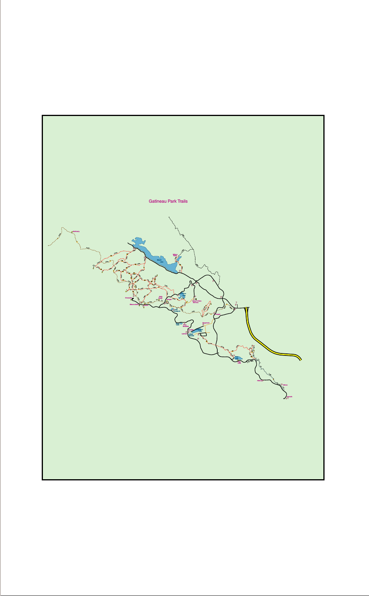
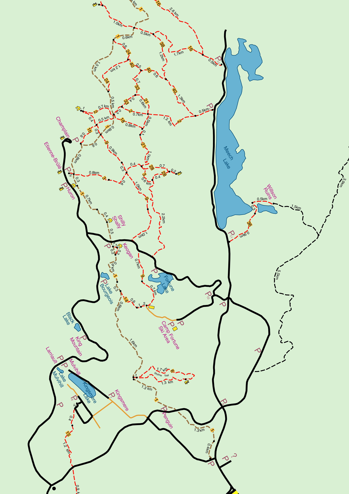
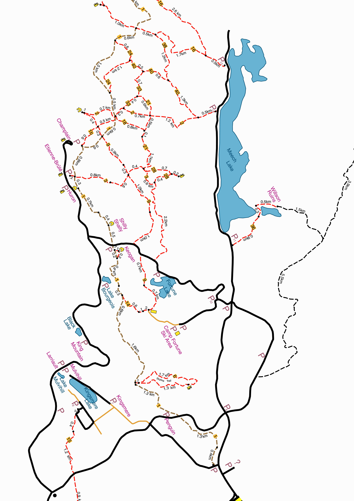

#The Problem

I was wanting to go to the Gatineau Park for a hike, and was looking around for some good maps of the trail.

While I found a number of the offical maps:
*[http://www.ncc-ccn.gc.ca/sites/default/files/pubs/gatineau-park-summer-trail-map.pdf](Gatineau Park Summer Trails Map)
*[http://www.ncc-ccn.gc.ca/sites/default/files/pubs/gp_trailfactsheet-2014_e2_luskvillefalls.pdf](Luskville Falls Trail)
*[http://www.ncc-ccn.gc.ca/sites/default/files/pubs/gp_trailfactsheet_e3_wolf_0.pdf](Wolf Trail #62)


But was not happy with them.

I found this PDF map that I liked: [http://www.xcottawa.ca/img/maps/gatineau_trail_distances.pdf](http://www.xcottawa.ca/img/maps/gatineau_trail_distances.pdf) showing trails and their distances.
at the [Team XC Ottawa site](http://www.xcottawa.ca/about_us.php)

Here is a PNG of the PDF map:



However, as I wanted to actually print the map, there were some issues with this map:

*It inefficiently uses the real estate on the page, due to its rotation and scaling.
*The text on the trails denoting trail length were too small
*Some of the trails at the north and south end of the park were not of interest to me
*It had a pale blue background that I did not want to have, both from a readability perspective, and so as not to deplete my printer ink.

# Pre-requisites
* `PDFjam`: [http://www2.warwick.ac.uk/fac/sci/statistics/staff/academic-research/firth/software/pdfjam/](http://www2.warwick.ac.uk/fac/sci/statistics/staff/academic-research/firth/software/pdfjam/)
* `pdfTeX`, pdtLaTeX, LaTeX package 'pdfpages'
* `pdftops`: Part of xpdf [http://www.foolabs.com/xpdf/download.html](http://www.foolabs.com/xpdf/download.html)
* `ps2pdf`: [http://ghostscript.com/doc/current/Ps2pdf.htm](http://ghostscript.com/doc/current/Ps2pdf.htm)
* `psselect`: part of psutils [https://github.com/rrthomas/psutils](https://github.com/rrthomas/psutils)
* `ghostscript`: need here for verification but is dependency of several of the above programs [http://www.ghostscript.com/](http://www.ghostscript.com/)

# The Solution

1.Rotate, shift and scale
2.Remove backgound colour


## Rotate, shift and scale
This is pretty straight forward, although a number of iterations before I got to the particular scale, rotation, and translating.

*Use `pdfjam` to rotate, scale, and shift the original PDF:
```
$ pdfjam  --suffix rotated --scale 8 --angle '300' --offset '-1cm -2.5cm'  gatineau_trail_distances.pdf
```

PNG of PDF output:


## Remove the blue background
###Convert to postscript
```
$ pdftops gatineau_trail_distances-rotated.pdf
```
Producing `gatineau_trail_distances-rotated.ps`

###Find the blue colour: Edit the Postscript!
I used to do a lot of Postscript programming. Going in and changing values is something that you can do.

With some image editor, you need to find the actual values for the background colour.
I used `gimp` on `gatineau_trail_distances-rotated.png` and its colour picker indicated the RGB for the background is: `217,240,211` or in the 0..1 range: `0.851 0.9412 0.8275`

Now, open the postscript file and search for "0.851". 

Found on line 1265:
```
/DeviceRGB {} cs
[0.851 0.9412 0.8275] sc
/DeviceRGB {} CS
```

Change this to be a white background RGB `1,1,1`:
```
/DeviceRGB {} cs
[1 1 1] sc
/DeviceRGB {} CS
```

Preview with ghostscript as PNG:
```
$gs -dSAFER -dBATCH -dNOPAUSE -sDEVICE=png48 -dDOINTERPOLATE -dTextAlphaBits=4 -dGraphicsAlphaBits=4 -r600x600 -dMaxBitmap=500000000 -dAlignToPixels=0 -dGridFitTT=2 -sOutputFile=a.png ./gatineau_trail_distances-rotated-whitebg.ps
```

PNG of PS output:


## PDF
The final PDF is here: [gatineau_trail_distances-rotated-whitebg.pdf](gatineau_trail_distances-rotated-whitebg.pdf)


